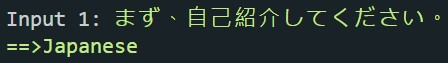
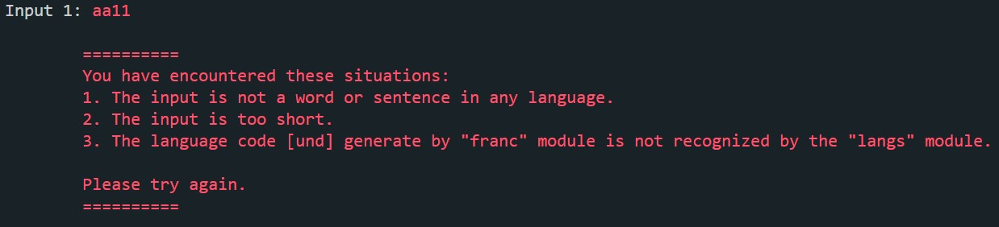

# Weird Language Guesser
<a name="readme-top"></a>

<!-- TABLE OF CONTENTS -->
<details>
  <summary>Table of Contents</summary>
  <ol>
    <li>
      <a href="#about-the-project">About The Project</a>
      <ul>
        <li><a href="#built-with">Built With</a></li>
      </ul>
    </li>
    <li>
      <a href="#getting-started">Getting Started</a>
      <ul>
        <li><a href="#prerequisites">Prerequisites</a></li>
        <li><a href="#installation">Installation</a></li>
      </ul>
    </li>
    <li><a href="#usage">Usage</a></li>

  </ol>
</details>


<!-- ABOUT THE PROJECT -->
## About The Project

### Intro 介紹
This is an simple script that I use to practice the installation of the npm package.


### Built With
- node.js

<p align="right">(<a href="#readme-top">back to top</a>)</p>

<!-- GETTING STARTED -->
## Getting Started

### Prerequisites
* node
* npm
  ```sh
  npm install npm@latest -g
  ```

### Installation

1. Clone the repo
   ```sh
   git clone https://github.com/VictorChao996/weird-language-guesser.git
   ```
2. Install NPM packages
   ```sh
   npm install
   ```


<p align="right">(<a href="#readme-top">back to top</a>)</p>


<!-- USAGE EXAMPLES -->
## Usage
- After install you can simply execute by the terminal. Pass your input as the argument to the index.js file.
```sh
node index.js "random sentance in any language..."
```

### Example
- single input
```sh
    node index.js  "まず、自己紹介してください。"
```
- multiple input
- single input
```sh
    node index.js  "まず、自己紹介してください。" "hello my name is Victor..."
```
- Result: Success

- Result: Fail



<p align="right">(<a href="#readme-top">back to top</a>)</p>

## Notices
> **Warning**
> - The result for the input will not be very precise.
> - Some languages code were not recognized by the package.

> **Note**
> - The search methods was provided by the ["franc"](https://github.com/wooorm/franc) package.
> - The transfer methods was provided by the ["lang"](https://github.com/adlawson/nodejs-langs) package. 


